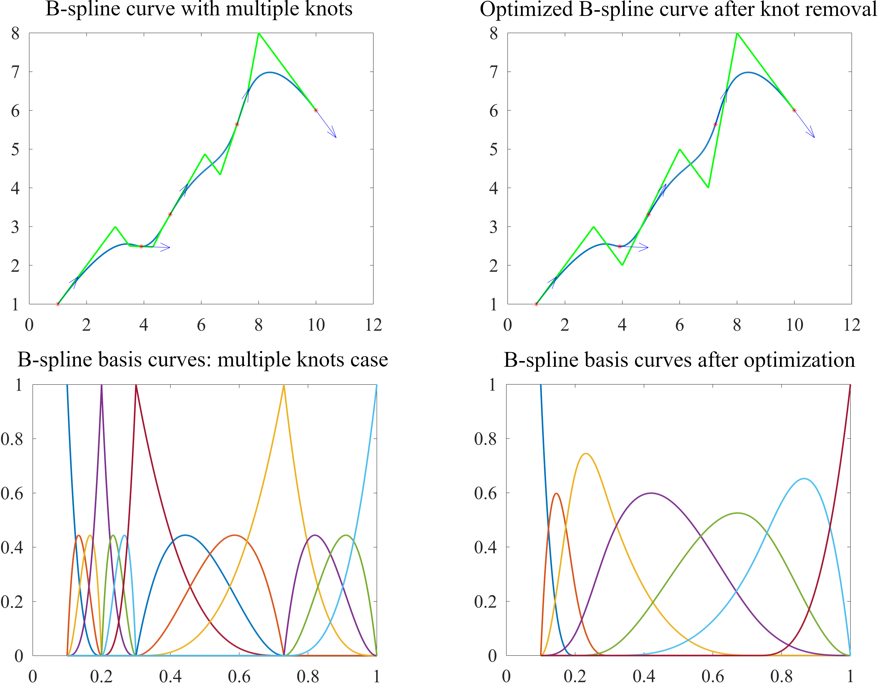

# Conversion of a spline curve to B-spline form

## Synopsis

To ensure flexibility and convenience of working with geometric models in CAD systems, algorithms for converting geometric representations are becoming in demand, among which methods of their one-to-one and exact transformation are of great importance. Here we propose a technique for converting a spline curve into a corresponding equivalent B-spline curve based on combining Bezier segments and the removal of multiple knots to obtain a more compact B-spline representation. This approach makes it possible to construct a B-spline curve based on information about its individual points without using standard fitting tools and complex interpolation schemes.

This is `C/C++` implementation of the B-Spline curve fitting algorithm.

## Use cases
The program is organized as the following use cases. 

`testSpline`:
- Import spline curve parameters from file. 
- Output a set of points a spline curve  with a step `0.001` for the whole curve.
- Output a set of points for a spline curve with a step `0.001` for a segment **0** of the curve.
 
`testBSpline`: 
- Import B-spline curve parameters from file.
- Print a number of segnents.
- Output a set of selected points and derivatives for a given set of parameter values. <br /> Example:  `double t[npar] = {0.1, 0.2, 0.3, 0.73, 1};`
- Output a set of control points of the B-spline curve.
- Output a set of points of the B-spline curve with step `0.001` for the whole curve. 

`testBasis`: 
- Import B-spline curve parameters from file.
- Print number of segments for the B-spline curve.
- Print number of basis functions according to the number of control points.
- Output a set of points for basis functions of the B-spline curve with a step `0.001`.

`fitCurve` (convert spline curve to B-spline curve with multiple knots): 
- Import spline curve parameters from file. 
- Print knots size of a spline curve according to a number of segments.
- Print knots size of a composite curve.
- Fit B-spline curve for each spline segments. 
- Output segment data in B-spline form.
- Output a set of control points for each segment.
- Output a set of points for each segment with step `0.001`.
- Output a set of points for composite curve.
- Export a composite B-spline curve parameters corresponding to the spline.

`optimizeCurve` (remove extra knots from the B-spline curve produced by `fitCurve`):
- Import the parameters of B-spline curve produced by `fitCurve`.
- Remove extra knots from the composite B-spline curve.
- Output the control points of optimized B-spline curve.
- Output a set of points of the optimized B-spline curve with step `0.001`.

`fitOptimizeCurve` (convert spline curve to B-spline):
- Import spline curve parameters from file. 
- Run `fitCurve` and `optimizeCurve`.

## How to build

Use `cmake` to build program. In case of creating separate `build` folder copy the contents of the `input` folder and create `output` folder.
```
mkdir build
cd build/
cmake ..
make
cp -r ../input .
mkdir output
```
## Results
The algorithm of conversion consists of two parts: merging Bezier segments `fitCurve` and optimizing that representation by means of knot removal algorithm `optimizeCurve`. Given the sample spline curve
```
n 4

knots
5
0.1 0.2 0.3 0.73 1

controls
(1, 1, 0)
(3.90873, 2.4881, 0)
(4.91607, 3.31514, 0)
(7.24717, 5.63957, 0)
(10, 6, 0)

derivatives
(60, 60, 0)
(12.2619, -0.357143, 0)
(8.43441, 10.8827, 0)
(4.07908, 9.08418, 0)
(22.2222, -22.2222, 0)
```
we obtain the following B-spline curve (left panes of the image) with multiple knots by means of `fitCurve`:
```
is_closed       0
is_periodic     0
n       12
k       4

knots
17      0.1     0.1     0.1     0.1     0.2     0.2     0.2     0.3     0.3     0.3     0.73    0.73    0.73    1       1       1       1


controls
(1, 1, 0)
(3, 3, 0)
(3.5, 2.5, 0)
(3.90873, 2.4881, 0)
(4.31746, 2.4762, 0)
(4.63492, 2.95238, 0)
(4.91607, 3.31514, 0)
(6.125, 4.87499, 0)
(6.6625, 4.3375, 0)
(7.24717, 5.63957, 0)
(7.61429, 6.45715, 0)
(8, 8, 0)
(10, 6, 0)
```
that can be optimized (right panes of the image) by the knot removal algorithm `optimizeCurve`:
```
is_closed       0
is_periodic     0
n       12
k       4

knots
17      0.100000000000000005551 0.100000000000000005551 0.100000000000000005551 0.100000000000000005551 0.200000000000000011102 0.200000000000000011102 0.200000000000000011102 0.299999999999999988898 0.299999999999999988898 0.299999999999999988898      0.729999999999999982236 0.729999999999999982236 0.729999999999999982236 1       1       1       1


controls
(1, 1, 0)
(3, 3, 0)
(3.5, 2.50000476666666671122, 0)
(3.90872999999999981569, 2.48810000000000020037, 0)
(4.31745999999999963137, 2.47619523333333368953, 0)
(4.63492300000000057025, 2.95238333333333358155, 0)
(4.91607000000000038398, 3.3151399999999999757, 0)
(6.12500210000000055999, 4.87499366666666666958, 0)
(6.66250186666666621704, 4.33750419999999969889, 0)
(7.24716999999999966775, 5.63956999999999997186, 0)
(7.61428719999999970014, 6.45714620000000039113, 0)
(8.00000200000000027956, 7.99999800000000060862, 0)
(10, 6, 0)
```
Running `testBSpline` with `plotbspl.m` for converted (left) and optimized (right) B-spline curve:



## References

1. Rogers D.F.,Adams J.A. Mathematical elements for computer graphics. 2nd Edition, McGraw-Hill, New York,1990.
2. Piegl L.A., Tiller W. The NURBS Book. Second edition. New York: Springer–Verlag.— 1995–1997.

## License

This code is distributed under GNU General Public License v3.0.
